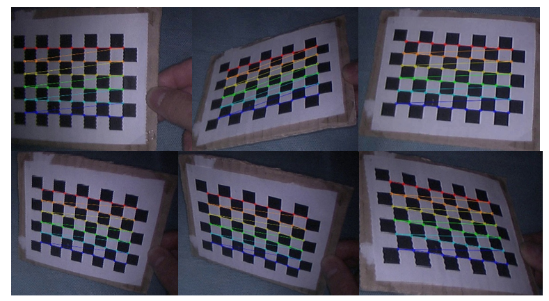

# Calibration
The code "get_frame.py" allows to extract frames from calibration videos and save them into two different folders. 
The code "cal_par.py" extract from the calibration frames the calibration parameters and save them in a .xml file

## Calibration procedure
The calibration procedure for the endoscope mounted on the dVRK, as described in reference, involves using a chessboard pattern of known size. This chessboard calibration method is widely used because the corners of the chessboard provide easily detectable features for mapping and calibration. The procedure was implemented using OpenCV, a popular library for image processing and computer vision tasks, and a 9x6 chessboard with squares of 9.8 mm. The calibration workflow consists of the following steps:

    * The chessboard is attached to a plane that represents the world reference system. The plane represents $Z=0$ in the world reference system, while corner is chosen to define the origin of this system. Since the corners are equally spaced, any other corner can be localized with reference to this origin.
    
    * Images of the chessboard are captured from different viewpoints by rotating and moving it. The chessboard should be moved horizontally and vertically to perform accurate X-Y calibration, and it should be rotated and scaled to achieve good skew and size calibration.
    
    * In each image, the coordinates of the chessboard corners are extracted. 
    
    * The intrinsic parameters, such as focal length and principal point, are computed using the extracted corner coordinates from multiple images. These parameters describe the internal characteristics of the camera.
    
    * For each image, the external parameters are computed. These parameters describe the rotation of one camera with respect to the other. In the case of the endoscope mounted on the dVRK, the rotation matrix and translation vector represent the position of the right camera with respect to the left camera.
    
    * Finally, distortion parameters are estimated to minimize the distance between the reprojected points and the corners of the chessboard. Distortion can be caused by lens imperfections and should be accounted for in the calibration process.

The calibration procedure, as illustrated in Figure, enables accurate mapping of the chessboard corners in various positions and orientations, facilitating the computation of intrinsic and extrinsic camera parameters for subsequent computer vision tasks.

  

Since calibration procedure is an iterative process of minimization of errors, if more images are acquired, the output will be more accurate.
