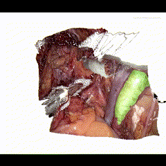

# DaVinci_project
## Introduction
### Project Description

The project aims to reconstruct the surgical scene in 3D acquired from the Da Vinci system, segmenting and highlighting the common iliac artery.

The repository is organized as follows:

#### 1. Calibration
In this folder, you can find code to acquire calibration images from the Da Vinci (--) and code to obtain calibration parameters (--). Additionally, there is a sample dataset included.

#### 2. Offline
In this folder, you can find code (---) for 3D reconstruction and segmentation of images from a dataset.

#### 3. Online
In this folder, you can find code (---) for real-time 3D reconstruction and segmentation of vessels using images from the Da Vinci system.
